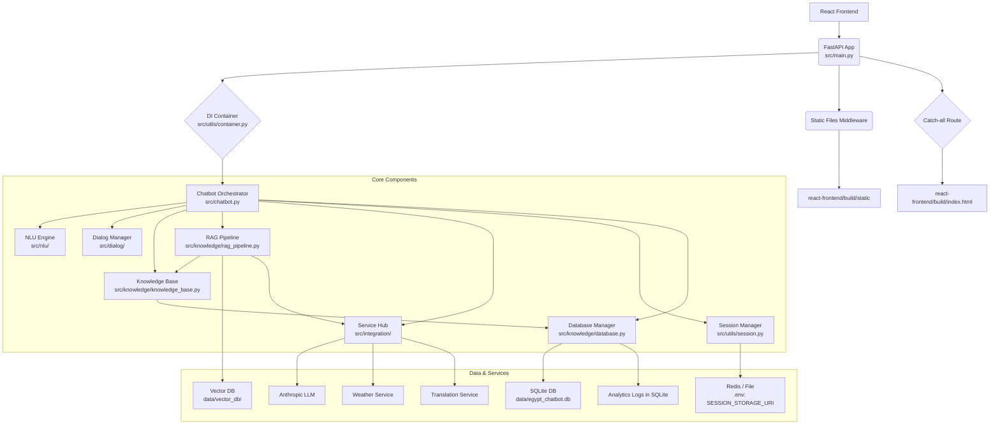

# Egypt Tourism Chatbot Architecture

## Overview

This document describes the backend architecture for the Egypt Tourism Chatbot, built using FastAPI. The system employs a modular design with Dependency Injection (DI) to manage components. A core FastAPI application (`src/main.py`) handles HTTP requests, orchestrates processing via a `Chatbot` service, and serves the React frontend.

## Architecture Diagram

_Diagram showing request flow from Frontend to FastAPI, DI Container providing components (Chatbot, NLU, Dialog, KB, RAG, ServiceHub, SessionMgr, DBMgr) to the Chatbot Orchestrator. DBMgr interacts with SQLite. SessionMgr interacts with Redis/File. ServiceHub interacts with external APIs. FastAPI also serves static files and index.html._

## Components

- **FastAPI App (`src/main.py`):**
  - Main application entry point.
  - Initializes DI container, middleware (CORS, Performance, Rate Limiting).
  - Defines API routes using FastAPI decorators (`@app.get`, `@app.post`).
  - Includes API Routers (e.g., `analytics_router` from `src/api/analytics_api.py`).
  - Delegates core chatbot logic to the `Chatbot` service retrieved via DI.
  - Serves the built React frontend (static files and `index.html`).
- **DI Container (`src/utils/container.py`, `src/utils/factory.py`):**
  - Manages component instantiation and dependency injection.
  - `ComponentFactory` reads configuration (`.env`, `configs/*.json`) and registers component factories.
  - Provides singleton instances of services on demand (`container.get(...)`).
- **Chatbot Orchestrator (`src/chatbot.py`):**
  - Central class coordinating the conversation flow.
  - Receives user messages via API endpoints.
  - Uses Session Manager to load/save conversation context.
  - Calls NLU Engine to process input.
  - Calls Dialog Manager to determine the next action.
  - Calls Knowledge Base, RAG Pipeline, or Service Hub as directed by the Dialog Manager.
  - Calls Response Generator to formulate the final reply.
  - Logs interactions using the Database Manager.
- **NLU Engine (`src/nlu/`):**
  - Responsible for Natural Language Understanding.
  - Performs language detection (`language.py`).
  - Classifies user intent (`intent.py`) using examples, regex, and context.
  - Extracts entities (`entity.py`) using regex, fuzzy matching, and potentially ML models (spaCy/Transformers if configured).
  - Resolves entities against the Knowledge Base.
- **Dialog Manager (`src/dialog/`):**
  - Manages the conversation state and flow based on `configs/dialog_flows.json`.
  - Determines the next action (e.g., respond, prompt for info, call service) based on current state and NLU result.
- **Knowledge Base (`src/knowledge/knowledge_base.py`):**
  - Provides an abstraction layer for accessing structured information.
  - Delegates database operations (getters, searches) to the injected `DatabaseManager`.
- **Database Manager (`src/knowledge/database.py`):**
  - Handles all interactions with the primary **SQLite** database (`data/egypt_chatbot.db`).
  - Provides methods for CRUD operations on KB tables (attractions, accommodations, restaurants).
  - Manages user data (if authentication is implemented).
  - Logs analytics events to the database.
- **RAG Pipeline (`src/knowledge/rag_pipeline.py`):**
  - Implements Retrieval-Augmented Generation (experimental/future).
  - Uses Vector DB to find relevant documents/KB entries.
  - Uses Knowledge Base to retrieve full content.
  - Uses an LLM (via Service Hub) to synthesize answers based on retrieved context.
- **Vector DB (`src/knowledge/vector_db.py`):**
  - Manages vector embeddings for similarity searches (used by RAG/NLU).
  - Currently configured for local file storage (`data/vector_db/`).
- **Service Hub (`src/integration/service_hub.py`):**
  - Manages connections and calls to external services (defined in `configs/services.json`).
  - Includes plugins for Anthropic LLM, Weather API, Translation API.
- **Session Manager (`src/utils/session.py`):**
  - Manages user conversation sessions and context.
  - Configured via `SESSION_STORAGE_URI` in `.env` to use **Redis** (recommended) or file storage.
- **Response Generator (`src/response/generator.py`):**
  - Constructs the final response text sent to the user.
  - Uses templates (potentially from `configs/response_templates/`) and data retrieved during processing.

## Data Flow (Typical Request)

1.  User sends message via React Frontend.
2.  React Frontend POSTs to FastAPI `/api/chat` endpoint.
3.  FastAPI `chat_endpoint` receives request, validates data using `ChatMessageRequest` model.
4.  `chat_endpoint` retrieves `Chatbot` instance from DI container.
5.  `Chatbot.process_message` is called.
6.  `SessionManager` retrieves/creates session context (from Redis/file).
7.  `NLUEngine` processes the message text, performs intent classification and entity extraction, potentially calling `KnowledgeBase` for entity resolution.
8.  `SessionManager` updates context with NLU results.
9.  `DialogManager` determines the next action based on NLU result and context.
10. If action requires KB lookup: `KnowledgeBase` is called, which calls `DatabaseManager` to query SQLite.
11. If action requires external service: `ServiceHub` calls the relevant plugin (e.g., Anthropic API).
12. `ResponseGenerator` creates the response text based on action, NLU, context, and retrieved data.
13. `DatabaseManager` logs the interaction for analytics.
14. `Chatbot` returns the final response dictionary.
15. FastAPI validates the response against `ChatbotResponse` model and sends JSON back to the frontend.

## Database Schema

Refer to `init_db.py` for the definitive schema.

- **Primary Database:** SQLite (`data/egypt_chatbot.db`)
- **Tables:**
  - `attractions`: Stores details about tourist attractions.
  - `accommodations`: Stores hotel/lodging information.
  - `restaurants`: Stores restaurant information.
  - `users`: (If user authentication features are used) Stores user credentials and roles.
  - `analytics_log`: Stores interaction events for analytics.
- **JSON Data:** Many tables include a `data` column (JSON Text) to store less structured or additional information from the original JSON sources.

## Session Management

- Handled by `src/utils/session.py::SessionManager`.
- Configured via `.env` (`SESSION_STORAGE_URI`).
- **Redis** is the recommended backend for persistence and scalability.
- File storage is available for simpler setups or testing.

## Deployment Considerations

- Requires Python 3.12+, Node.js (for frontend build).
- Run using a production-grade ASGI server like Uvicorn, managed by Gunicorn or similar.
- Serve static files efficiently (FastAPI provides basic serving, Nginx is better for production).
- Requires `.env` file with appropriate production settings (API keys, JWT secret, database URI, session URI).
- Docker image can be built using the provided `Dockerfile` example.
