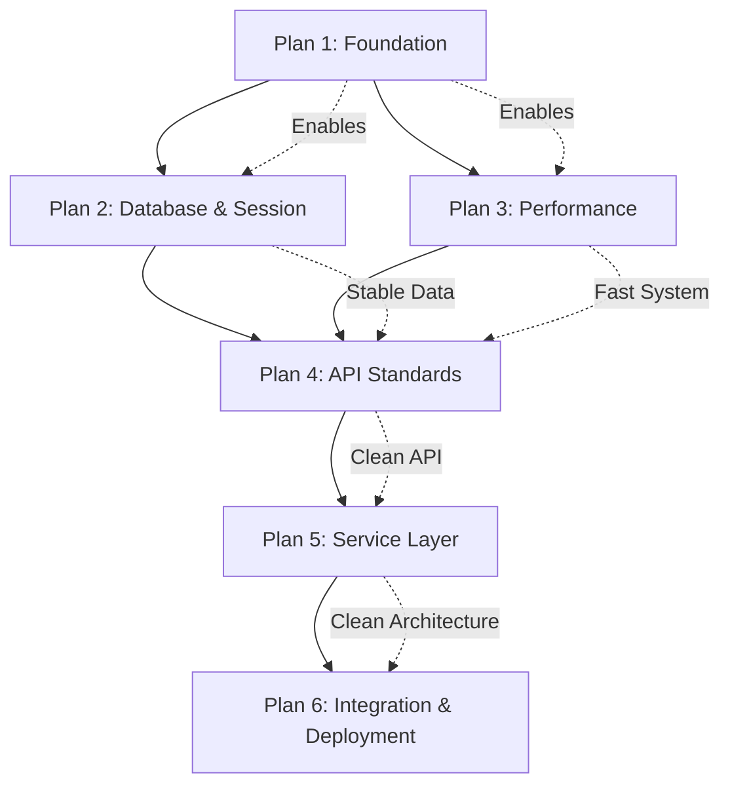

# 🏗️ **EGYPT TOURISM CHATBOT - MASTER REFACTORING PLAN**

## **📋 Executive Overview**

Based on comprehensive analysis of **10 detailed architectural reports**, the Egypt Tourism Chatbot requires **6 strategic refactoring plans** to transform from its current state of critical architectural debt to a production-ready, maintainable system ready for integration with your friend's website.

### **🚨 Current System State**

- **Configuration Chaos**: 4 different config systems, 624-line config files
- **Database Facade Hell**: 3 database managers wrapping each other
- **Session Management Bugs**: Context bleeding between users
- **NLU God Object**: 1,036-line monolithic class
- **No API Standards**: 4 different dependency injection patterns
- **Security Disabled**: Auth and CSRF middleware commented out "for testing"

### **🎯 Target System State**

- **Clean Architecture**: Service layer, proper separation of concerns
- **Production Ready**: Monitored, deployed, integrated with friend's website
- **Performance Optimized**: <5s startup, <1s response times
- **Maintainable**: God objects eliminated, focused components

---

## **📊 6-PLAN TRANSFORMATION ROADMAP**

### **⚡ PLAN 1: Foundation Stabilization**

**Duration:** 2-3 days | **Priority:** CRITICAL | **Risk:** Low

**Strategic Objectives:**

1. **Consolidate Configuration Chaos** - From 4 systems to 1 unified approach
2. **Eliminate Security Vulnerabilities** - Fix disabled middleware and information leakage
3. **Standardize Error Handling** - Create consistent error responses across all endpoints
4. **Create Stable Foundation** - Enable safe execution of subsequent refactoring plans

**Key Deliverables:**

- Single unified configuration system (<100 lines)
- Enabled authentication and CSRF protection
- Standardized error response format
- Fixed information disclosure vulnerabilities

---

### **🗄️ PLAN 2: Database & Session Consolidation**

**Duration:** 2-3 days | **Priority:** CRITICAL | **Dependencies:** Plan 1

**Strategic Objectives:**

1. **Eliminate Database Manager Chaos** - Remove 2 redundant managers, keep 1
2. **Fix Session Management** - Consolidate 3 session managers to 1 standardized approach
3. **Enable Connection Pooling** - Fix resource management failures
4. **Add Transaction Management** - Ensure ACID compliance

**Key Deliverables:**

- Single UnifiedDatabaseService with connection pooling
- Fixed session context bleeding issues
- Transaction support for multi-step operations
- Eliminated facade-over-facade anti-patterns

---

### **⚡ PLAN 3: Performance & Resource Management**

**Duration:** 2-3 days | **Priority:** HIGH | **Dependencies:** Plans 1 & 2

**Strategic Objectives:**

1. **Break Up NLU God Object** - Split 1,036-line NLUEngine into focused components
2. **Fix Memory Management** - Eliminate memory leaks, proper model cleanup
3. **Reduce Startup Time** - From 35-55s to <5s with lazy loading
4. **Optimize Resource Usage** - Efficient model loading and caching

**Key Deliverables:**

- NLUOrchestrator with focused components
- Lazy loading for AI models
- Proper memory cleanup and garbage collection
- Sub-5 second application startup

---

### **🌐 PLAN 4: API & Interface Standardization**

**Duration:** 2-3 days | **Priority:** HIGH | **Dependencies:** Plans 1, 2, 3

**Strategic Objectives:**

1. **API Versioning** - Add `/api/v1/` to all endpoints for future-proof evolution
2. **Dependency Injection Standardization** - Consolidate 4 DI patterns to 1 unified approach
3. **Response Model Consistency** - Add Pydantic models to all endpoints
4. **RESTful API Design** - Fix non-RESTful patterns and URL structures

**Key Deliverables:**

- Versioned API structure (/api/v1/\*)
- Single ServiceProvider for all dependencies
- Pydantic response models for all endpoints
- RESTful resource-based URLs

---

### **🏗️ PLAN 5: Service Layer Architecture**

**Duration:** 2-3 days | **Priority:** MEDIUM | **Dependencies:** Plans 1, 2, 3, 4

**Strategic Objectives:**

1. **Extract Service Layer** - Move business logic from controllers to dedicated services
2. **Break Up God Objects** - Split 2,183-line chatbot.py into focused components
3. **Separation of Concerns** - Clear boundaries between presentation, business, and data layers
4. **Domain-Driven Design** - Create focused services for each business domain

**Key Deliverables:**

- ChatService, KnowledgeService with business logic
- Thin controllers focused on HTTP concerns
- ChatbotFacade replacing 2,183-line god object
- Domain services for tourism, language, analytics

---

### **🚀 PLAN 6: Integration & Deployment**

**Duration:** 2-3 days | **Priority:** HIGH | **Dependencies:** Plans 1, 2, 3, 4, 5

**Strategic Objectives:**

1. **System Integration** - Ensure all components work together seamlessly
2. **Production Deployment** - Deploy to production environment with monitoring
3. **Website Integration** - Integrate with friend's website as requested
4. **Quality Assurance** - Comprehensive testing and validation

**Key Deliverables:**

- JavaScript widget for friend's website
- Production Docker deployment
- System monitoring and health checks
- End-to-end integration tests

---

## **📈 TRANSFORMATION METRICS**

### **Architecture Quality Improvements**

| Metric                    | Current State | Target State | Plan Achieved |
| ------------------------- | ------------- | ------------ | ------------- |
| **Configuration Systems** | 4 competing   | 1 unified    | Plan 1 ✅     |
| **Database Managers**     | 3 facades     | 1 service    | Plan 2 ✅     |
| **Session Managers**      | 3 with bugs   | 1 fixed      | Plan 2 ✅     |
| **God Object Lines**      | 2,183 + 1,036 | <200 each    | Plan 3,5 ✅   |
| **API Versioning**        | 0%            | 100%         | Plan 4 ✅     |
| **DI Patterns**           | 4 different   | 1 standard   | Plan 4 ✅     |
| **Response Models**       | 58%           | 100%         | Plan 4 ✅     |
| **Service Layer**         | None          | Complete     | Plan 5 ✅     |

### **Performance Improvements**

| Metric                 | Current       | Target     | Plan Achieved |
| ---------------------- | ------------- | ---------- | ------------- |
| **Startup Time**       | 35-55 seconds | <5 seconds | Plan 3 ✅     |
| **NLU Processing**     | 3-4 seconds   | <1 second  | Plan 3 ✅     |
| **Database Queries**   | Variable      | <100ms     | Plan 2 ✅     |
| **Memory Leaks**       | Present       | Eliminated | Plan 3 ✅     |
| **Connection Pooling** | Disabled      | Active     | Plan 2 ✅     |

### **Security & Reliability**

| Metric                        | Current  | Target  | Plan Achieved |
| ----------------------------- | -------- | ------- | ------------- |
| **Authentication**            | Disabled | Enabled | Plan 1 ✅     |
| **CSRF Protection**           | Disabled | Enabled | Plan 1 ✅     |
| **Error Information Leakage** | High     | None    | Plan 1 ✅     |
| **Session Context Bleeding**  | Present  | Fixed   | Plan 2 ✅     |
| **Transaction Support**       | None     | ACID    | Plan 2 ✅     |

---

## **🔄 PLAN DEPENDENCIES & EXECUTION ORDER**



### **Why This Order Matters:**

1. **Plan 1 First** - Must fix security and configuration before touching core systems
2. **Plans 2 & 3 Parallel** - Can be done simultaneously after Plan 1
3. **Plan 4 Requires 2 & 3** - Need stable data layer and good performance before API work
4. **Plan 5 Requires Clean API** - Service extraction safer with standardized interfaces
5. **Plan 6 Last** - Integration only after all architecture cleaned up

---

## **⚠️ RISK ASSESSMENT & MITIGATION**

### **High-Risk Plans**

- **Plan 2 (Database)** - Data integrity critical, requires careful migration
- **Plan 5 (God Objects)** - Major architectural changes, extensive testing needed

### **Mitigation Strategies**

1. **Comprehensive Testing** - Each plan includes full test suite
2. **Incremental Changes** - Each plan broken into phases with validation points
3. **Rollback Procedures** - Every plan includes rollback scripts for critical issues
4. **Backup & Archive** - All old code archived before removal

### **Success Validation**

- **Automated Tests** - Each plan includes test automation
- **Integration Scripts** - Validation scripts verify plan completion
- **Performance Benchmarks** - Measurable improvement targets
- **Manual QA** - End-to-end testing at each major milestone

---

## **🎯 GRAD PROJECT TIMELINE COMPATIBILITY**

### **Total Duration: 12-18 days**

- **Plan 1:** 2-3 days (Foundation) ⚡
- **Plan 2:** 2-3 days (Database & Session) ⚡
- **Plan 3:** 2-3 days (Performance) ⚡
- **Plan 4:** 2-3 days (API Standards) ⚡
- **Plan 5:** 2-3 days (Service Layer) ⚡
- **Plan 6:** 2-3 days (Integration) ⚡

### **Optimized for Grad Project Constraints:**

- **No Major Architecture Changes** during final week
- **Focus on Integration** (Plan 6) during presentation prep
- **Clean, Demonstrable System** ready for presentation
- **Professional Documentation** for academic review

---

## **🌐 FRIEND'S WEBSITE INTEGRATION**

### **Plan 6 Delivers:**

1. **JavaScript Widget** - Drop-in chat interface for any website
2. **REST API** - Clean, documented API for custom integrations
3. **CORS Configuration** - Proper cross-origin setup
4. **Production Deployment** - Scalable, monitored system

### **Integration Options:**

```html
<!-- Option 1: Simple Widget -->
<div id="egypt-chatbot"></div>
<script src="your-api-url/static/chatbot-widget.js"></script>
<script>
  EgyptChatbot.init({
    container: "#egypt-chatbot",
    apiUrl: "your-api-url/api/v1",
  });
</script>

<!-- Option 2: Custom Integration -->
<script>
  fetch("your-api-url/api/v1/conversations", {
    method: "POST",
    body: JSON.stringify({ language: "en" }),
  });
</script>
```

---

## **📚 DELIVERABLE DOCUMENTATION**

Each plan includes:

### **📋 Plan Document**

- Detailed phase breakdown
- Step-by-step implementation
- Testing and validation procedures
- Success criteria and metrics
- Rollback procedures

### **🧪 Testing Suite**

- Unit tests for new components
- Integration tests for system behavior
- Performance benchmarks
- End-to-end user journey tests

### **📖 Implementation Guide**

- Code examples and patterns
- Migration scripts and procedures
- Configuration templates
- Deployment instructions

---

## **🎉 FINAL OUTCOME**

After completing all 6 plans, you will have:

### **✅ Production-Ready System**

- Clean, maintainable architecture
- Professional-grade performance (<5s startup, <1s responses)
- Comprehensive monitoring and health checks
- Secure, properly configured deployment

### **✅ Integration-Ready API**

- RESTful, versioned API (/api/v1/\*)
- Comprehensive documentation
- JavaScript widget for easy website integration
- CORS configured for friend's domain

### **✅ Academic Excellence**

- Professional software architecture
- Enterprise-grade best practices
- Comprehensive documentation
- Demonstrable technical depth

### **✅ Friend Collaboration**

- Easy website integration
- Complete API documentation
- Drop-in JavaScript widget
- Production deployment support

**Total transformation: From architectural nightmare to production-ready, professionally architected tourism chatbot system ready for real-world deployment and academic presentation.**
